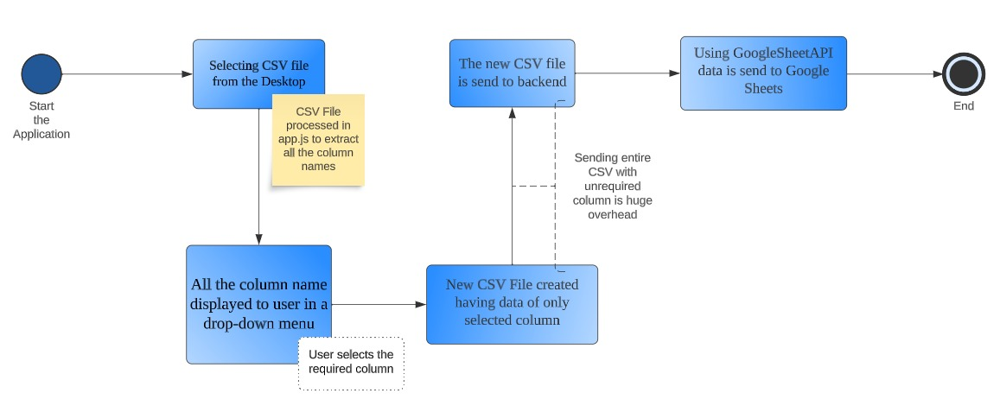

# CSV Impoter for google sheet  

**Video link** -  [CSV Importer](https://drive.google.com/file/d/1FSx9TWcNllDfDe2tuFl2PYAzmjaRlfZv/view?usp=sharing)

### Explaination 
This web application allows users to select specific columns from a CSV file and import the selected data into a Google Sheets spreadsheet. It's a convenient way to avoid sending unnecessary data to the backend and streamline the process of importing CSV data into Google Sheets.

*_Getting Started_*  

Follow these steps to set up and run the application:

*_Prerequisites_*  

Node.js and npm installed on your system.
A Google Cloud service account key with access to the Google Sheets API. You can obtain this key by following the Google Sheets API documentation.

*_Installation_*  

1. Clone the repository to your local machine.
```
git clone https://github.com/yourusername/csv-importer.git
cd csv-importer
```
2. Install the required dependencies.
```
npm install
```

*_Configuration_*  

1. Create a Google Cloud service account key JSON file and save it as path_to_your_service_account_key.json. Make sure this key has access to the Google Sheets API.
2. Open server.js and replace the placeholders with your own configurations:
  - 'path_to_your_service_account_key.json' with the path to your service account key file.
  - 'your_spreadsheet_id' with the ID of the Google Sheets spreadsheet where you want to paste the data.
  - 'Sheet1' with the name of the sheet in your spreadsheet where you want to paste the data.

_*Usage*_  

1. Start the server.
```
npm start
```
2. Access the web application in your browser at http://localhost:3000.
3. Select a CSV file using the file input field.
4. Choose one or more columns from the dropdown list that you want to import.
5. Click the "Import CSV" button to initiate the import process.
6. The application will send only the selected columns to the backend, which will then paste the data into your Google Sheets spreadsheet.

*_Program Files_*  

- server.js: The Node.js backend that handles the file upload and data import into Google Sheets. It also serves static files and sets up the Express server.
- public/index.html: The HTML file for the web application's user interface, where users can select columns and upload a CSV file.
- public/app.js: The JavaScript file responsible for handling user interactions and sending selected CSV data to the backend.

### Workflow Explanation  

